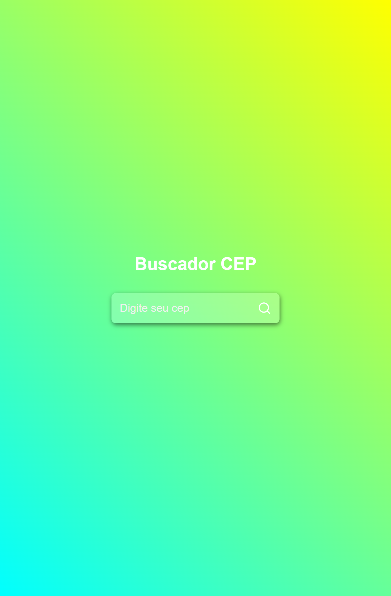

# BUSCADOR DE CEP

> PROGETO CRIADO COM REACT.JS, VOCÊ PODE COLOCAR QUALQUER CEP ELE TRAZ PARA VOCÊ CONPLEMENTO, ESTADO, RUA, CIDADE. QUANDO USA UM CEP IVALIDO ELE MANDARA UM ALERTA.

## TECNOLOGIAS

- HTNL

- CSS

- REACT.JS

- GITHUB

- GIT

## CANTATO 😎

- (11)956195935

- eliabecruzsilva78@gmail.com
